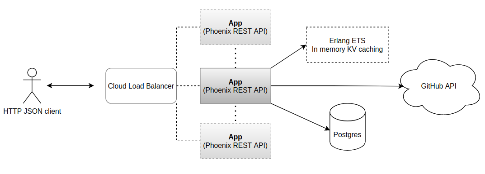

<div align="center">
  <h1><code>github-searcher-ex</code></h1>

  <strong>GitHub searcher API app in Elixir with Phoenix 💧🔥</strong>
</div>

## Demo

This demo project has been deployed on Heroku. This is a high level diagram of this project:



## Development

To facilitate development, there's a [Makefile](./Makefile) with some frequently used commands.

#### Pre-requisites

Make sure you have installed these dependencies:

- docker
- docker-compose

Additionally, if you're going to contribute:

- pre-commit (`pre-commit install`)
- Elixir with Erlang/OTP locally.
- This project was initially built with Elixir 1.11 and Erlang OTP 23.

### How to run

- `make compose-up`

#### Trying it out

Locally with docker running, you can try out the API on [this URL](http://localhost:8080/api/v1), if you visit this on your browser you should see a Phoenix NoRouterError showing the existing routes in place:

```
Available routes
        search_path  GET   /api/v1/searches        GithubWeb.SearchController :index
        search_path  GET   /api/v1/searches/:id    GithubWeb.SearchController :show
     gh_search_path  POST  /api/v1/repos/search    GithubWeb.GhSearchController :create
    repository_path  GET   /api/v1/repos           GithubWeb.RepositoryController :index
    repository_path  GET   /api/v1/repos/:id       GithubWeb.RepositoryController :show
live_dashboard_path  GET   /dashboard              Phoenix.LiveView.Plug :home
live_dashboard_path  GET   /dashboard/:page        Phoenix.LiveView.Plug :page
live_dashboard_path  GET   /dashboard/:node/:page  Phoenix.LiveView.Plug :page
```

### How to test

Once you have it running:

- `make test`

### How to stop

- `make compose-down`
